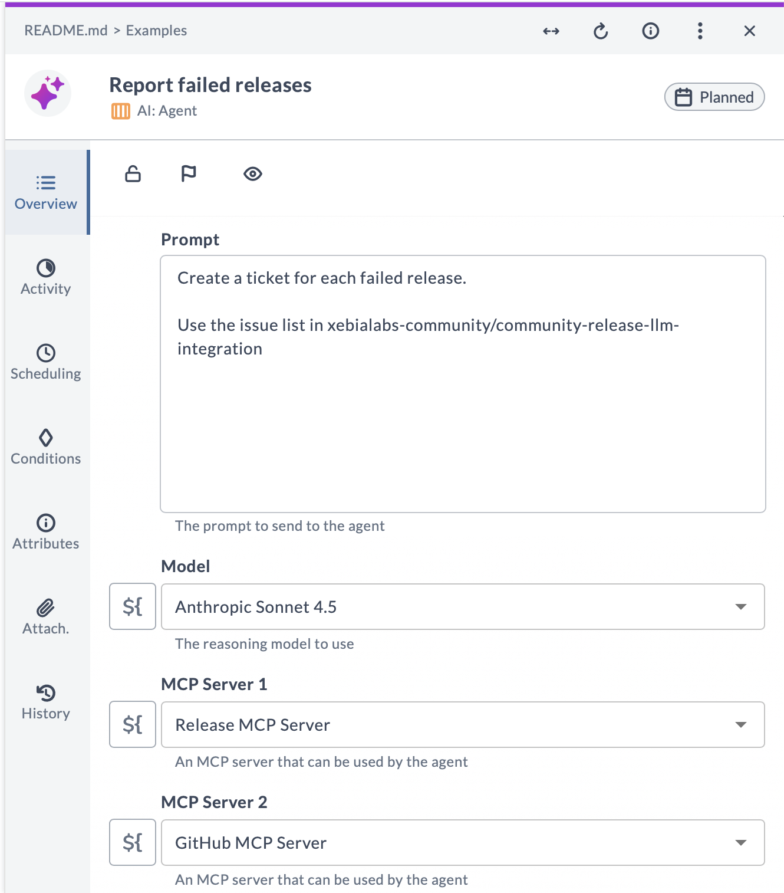
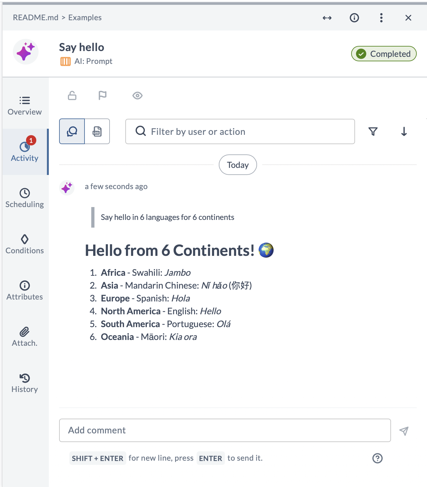
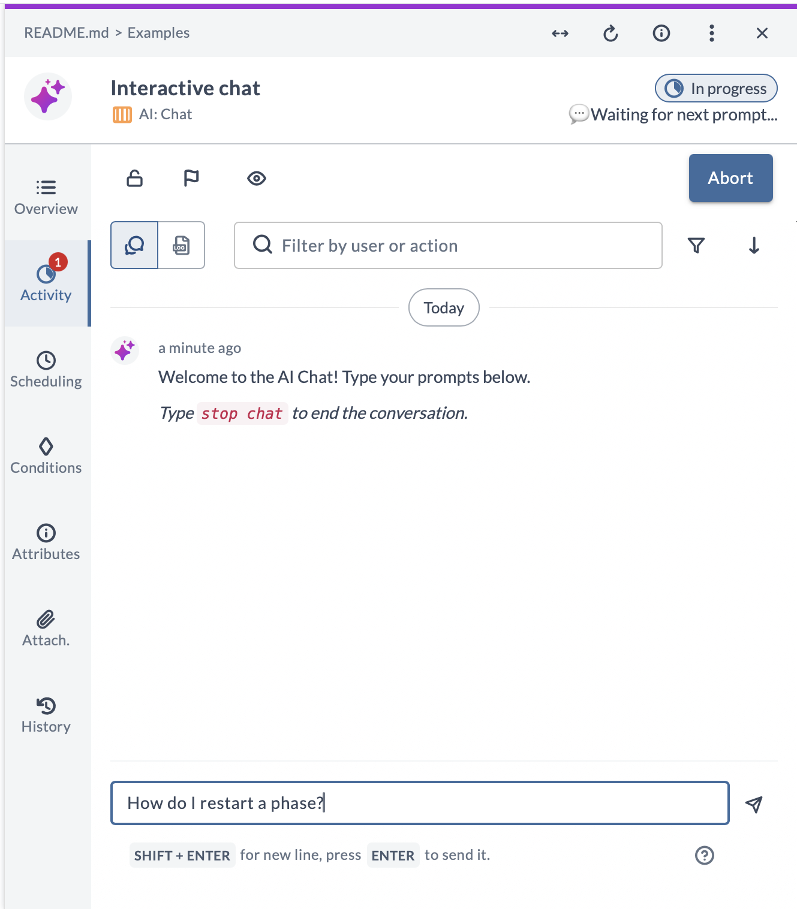
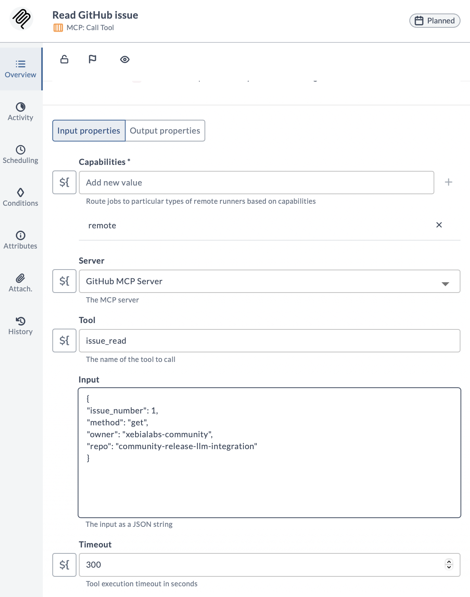
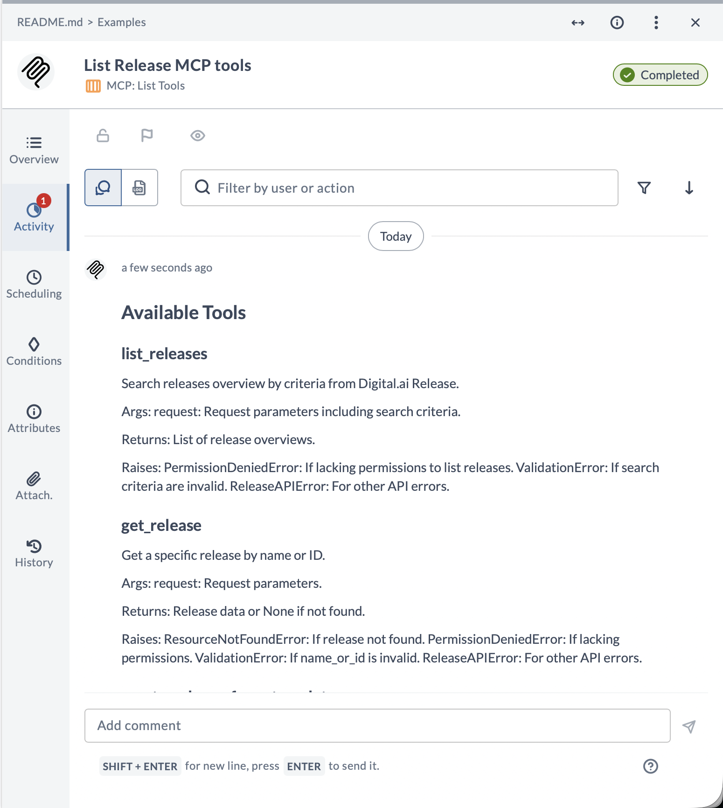
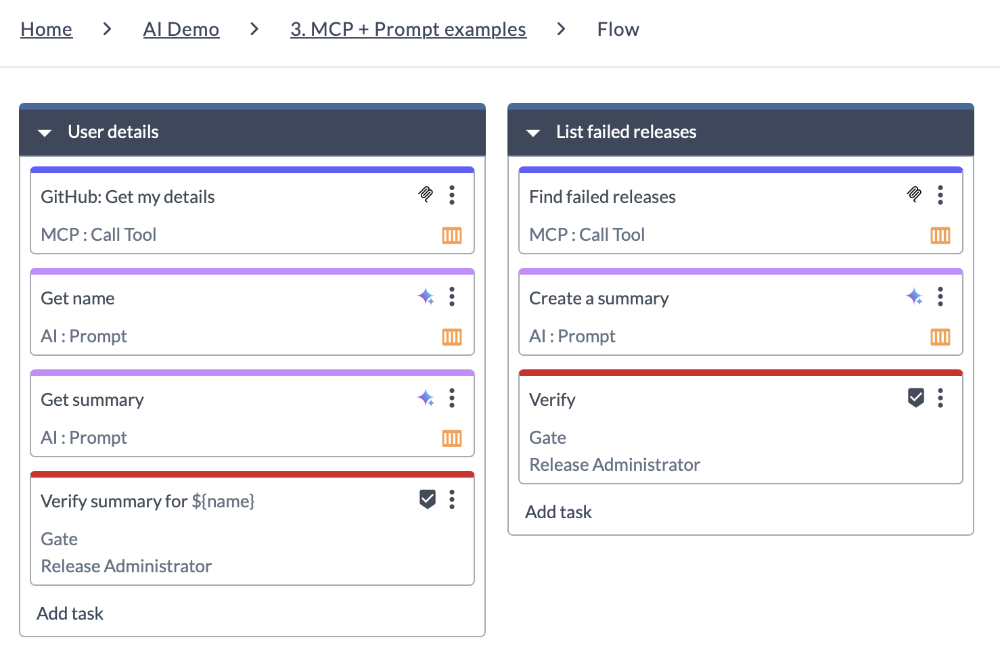

# AI tasks for Digital.ai Release

Create AI-powered automation workflows in Release!

This integration provides tasks for Release to interact with LLMs like OpenAI and Gemini and interact with any MCP
servers.

* Create AI agents that perform complex tasks using MCP tools
* Call services directly using MCP, without writing any code
* Embed AI prompts in your Release workflows
* Start interactive chats with the LLM of your choice
* Connect to Gemini and OpenAI-compatible providers
* Connect to any MCP server
* Mix and match MCP servers and reasoning models per task, to get the right tool for the job

## Tasks

### AI: Agent

Creates an AI agent that can use MCP tools to accomplish tasks.



### AI: Prompt

Connect to an AI server and invoke a single prompt. Supports Gemini and OpenAI-compatible LLM providers.



### AI: Chat

Interactive chat with an LLM, inside the task's Activity section.



### MCP: Call tool

Connect to any MCP server and invoke its tools. No LLM reasoning, just direct tool calls.



### MCP: List Tools

Lists available tools on an MCP server



## Demo templates

This repo comes with example templates showing how to use the tasks.



1. **MCP Examples** -- Demonstrates the MCP tool tasks that allows you to interact with 3rd party servers without having
   to write an integration plugin. (no LLM involved).
2. **Prompt examples** -- Demonstrates the AI Prompt task with different model providers (Gemini, OpenAI, etc).
3. **MCP + Prompt examples** -- Demonstrates how to combine MCP and Prompt tasks to build AI-powered workflows.
4. **Agent examples** -- Demonstrates the AI Agent task that combines LLM prompting with multiple MCP servers.
5. **Interactive Chat example** -- Demonstrates the interactive AI Chat task.

See the **Build & Run** section on how to install the examples.

---

# Build & Run

This section explains how to set up a local Release instance with the plugin and upload the example templates.

## Prerequisites

You need to have the following installed in order to develop Python-based container tasks for Release using this
project:

* Python 3
* Docker

### Configure your `hosts` file

Add the following to `/etc/hosts` or `C:\Windows\System32\drivers\etc\hosts` (sudo / administrator permissions
required):

    127.0.0.1 host.docker.internal
    127.0.0.1 container-registry

## Start the development environment

This project comes with a Docker environment that sets up a local Release instance with all the required services.

Running the environment with this plugin is a three-step process:

1. Start the Release Docker environment
2. Build and publish the plugin
3. Upload the demo templates

When developing the plugin, typically you would just do step 2 after making code changes. The new version of the plugin
will be picked up without having to restart the server.

### 1. Start the Release environment:

The Release environment is defined in `dev-environment/docker-compose.yaml`.

#### Stopping

Have Docker running and launch the environment with:

```commandline
docker compose -f dev-environment/docker-compose.yaml up -d --build 
```

It takes a while to start up. You can see that the Release server is running when the `digitalai-release-setup`
container has terminated.

Check if you can log in with `admin/admin` at http://localhost:5516.

#### Stopping

After the demo, you can stop the environment with:

```commandline
docker compose -f dev-environment/docker-compose.yaml down
```

### 2. Build & publish the plugin

The `build.sh` script will build the plugin container, publish it to the local registry and install it to the local
Release instance.

Run the build script

**Unix / macOS**

```commandline
sh build.sh --upload
```

**Windows**

```commandline
build.bat --upload
```

### 3. Install example templates

#### Set up credentials

The sample templates come with examples to connect to various MCP servers and LLM providers.

Put your API keys in [setup/secrets.xlvals](setup/secrets.xlvals).

Use the example file as a base:

```commandline
cp setup/secrets.xlvals.example setup/secrets.xlvals
```

Then edit the file and add your keys.

#### Upload templates

Run the following command to upload the demo templates to the local Release instance:

```commandline
./xlw apply -f setup/mcp-demo.yaml
```

The templates will be uploaded to a new **AI Demo** folder.

---

## Demo time!

1. Log in to http://localhost:5516 with admin/admin
2. Go to the **AI Demo** folder
3. Go the **Templates** section and run the examples

👉Add your favorite MCP Server or LLM provider under Connections and build your own example!

---

## Developing

### Run the tests

The tests are integration tests and need API keys to run. Put your API keys in `.env` file in the root of the project:

```
GEMINI_API_KEY=<key>
OPENAI_API_KEY=<key>
DAI_LLM_API_KEY=<key>
```

Run the tests with the command

```commandline
```